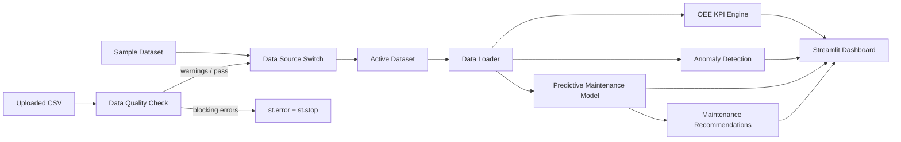

# Production Equipment Monitoring & Predictive Maintenance Dashboard

A local prototype demonstrating how a new manufacturing site could move away from
Excel-based tracking toward an operational data platform that supports real-time
visibility, equipment monitoring, anomaly detection, predictive maintenance, and
maintenance decision support.

---

## Business Problem

Manufacturing lines lose money in two ways:

1. **Equipment failures that nobody saw coming** — an unplanned machine failure costs
   roughly 5× more than a planned maintenance event (parts, labor, lost throughput,
   scrap).
2. **Inefficiencies that nobody measured** — machines may run at 60% OEE while
   supervisors believe they are running at 90%.

This dashboard addresses both. It gives supervisors visibility into OEE, machine
status, anomaly events, and maintenance risk. It converts sensor data into
maintenance recommendations and cost-benefit logic — shifting the operation from
reactive to predictive.

---

## Why This Project

This prototype demonstrates a complete **Visibility → Diagnosis → Prediction →
Recommendation → Action** pipeline without requiring real plant infrastructure.
It is designed to show how a manufacturing intelligence platform would work end-to-end
using:

- Synthetic sensor data that mimics real machine behavior
- Standard data-science tooling (scikit-learn, pandas, Plotly)
- A modular, maintainable Python architecture
- A Streamlit dashboard that non-technical stakeholders can operate

---

## Why Synthetic Data

- No confidentiality risk — no proprietary machine, product, or process data is used.
- Behavior is scripted, not random: each machine has a designed "story" that matches
  real failure patterns (gradual degradation, cooling faults, bottlenecks).
- Anomaly labels and maintenance targets are rule-based, making model behavior
  transparent and auditable.
- Any engineer can re-run the simulator with a different seed or machine profile and
  instantly get a new dataset.

---

## Features

| Feature | Implementation |
|---|---|
| Synthetic sensor data generation | `src/simulator.py` — 7 machines × 7 days × 1-minute resolution |
| OEE calculation (Availability × Performance × Quality) | `src/kpi.py` |
| Bottleneck identification | `src/kpi.py` — ranked by composite bottleneck score |
| Anomaly detection | `src/anomaly.py` — Isolation Forest |
| Anomaly explanation | `src/anomaly.py` — z-score deviation from machine baseline |
| Rule-based alert feed | `src/anomaly.py` — severity-ranked alerts |
| Predictive maintenance | `src/maintenance.py` — Random Forest Classifier |
| Health score (0–100) | `src/maintenance.py` — weighted risk components |
| Cost-benefit analysis | `src/recommendations.py` — planned vs unplanned cost |
| Time-travel historical replay | `app.py` — 15-minute step slider |
| Plotly charts | `src/visualization.py` |
| Data source switch | `app.py` sidebar — toggle between sample dataset and uploaded CSV |
| Data quality check | `src/data_quality.py` — 9 checks; blocking errors halt load, warnings allow continue |

---

## Dashboard Pages

### 1. Operations Command Center
Quick view of current factory health: OEE, machine status grid, alert feed,
and top-3 recommended actions.

### 2. OEE & Bottleneck Analysis
Breaks down OEE by machine and by factor (Availability / Performance / Quality).
Includes a 7-day trend chart and bottleneck ranking table.

### 3. Anomaly Detection
Isolation Forest ML model flags abnormal sensor readings. An explanation panel
shows which sensor deviated and by how much relative to the machine's baseline.

### 4. Predictive Maintenance
Random Forest model predicts 7-day failure probability. Displays health scores,
failure probability chart, maintenance recommendation table, and cost-benefit logic.

---

## Using Your Own Data

### How to upload a CSV

1. Open the dashboard (`streamlit run app.py`).
2. In the left sidebar, select **Upload Company CSV** under *Data Source*.
3. Click **Browse files** and select your `.csv` file.
4. A **Data Quality Report** will appear in the sidebar showing row count,
   machine count, time range, and any issues found.

### Required schema

Your CSV must contain these columns (additional columns are ignored):

| Column | Type | Notes |
|---|---|---|
| `timestamp` | datetime string | Any format parseable by `pd.to_datetime` |
| `machine_id` | string | Unique identifier per machine |
| `status` | string | Must be one of: `running`, `idle`, `down`, `maintenance` |
| `utilization_pct` | float | 0–100 |
| `temperature_c` | float | Sensor temperature in °C |
| `vibration_hz` | float | Vibration frequency in Hz |
| `output_count` | int | Units produced per row |
| `defect_count` | int | Defective units per row |
| `cycle_time_sec` | float | Cycle time in seconds (0 when machine is not running) |

Optional columns that improve the dashboard if present:
`shift`, `machine_age_factor`, `latent_degradation`, `event_type`, `downtime_reason`, `needs_maintenance`

### Data quality checks

The dashboard runs these checks automatically on upload:

**Blocking (must be fixed before the dashboard loads):**
- Missing required columns
- Timestamp values that cannot be parsed
- Missing `machine_id` values
- Invalid `status` values

**Warnings (dashboard runs, but worth reviewing):**
- Negative numeric sensor values
- Rows where `defect_count > output_count`
- Fully duplicate rows
- Duplicate `(machine_id, timestamp)` pairs
- Missing values in required columns

### Sample data option

Select **Use Sample Manufacturing Dataset** in the sidebar to revert to the
built-in 7-machine, 7-day synthetic dataset at any time.

---

## Architecture



---

## File Structure

```
manufacturing-monitoring-dashboard/
├── app.py                    # Streamlit entry point
├── README.md
├── requirements.txt
├── .gitignore
├── data/
│   └── .gitkeep              # CSV output written here by simulator
├── src/
│   ├── __init__.py
│   ├── config.py             # All thresholds, machine profiles, constants
│   ├── logger.py             # Shared logging setup
│   ├── schemas.py            # Dataclasses and column contracts
│   ├── simulator.py          # Synthetic data generator
│   ├── data_loader.py        # CSV load + auto-generate fallback
│   ├── data_quality.py       # Uploaded CSV validation and preparation
│   ├── kpi.py                # OEE and bottleneck logic
│   ├── anomaly.py            # Isolation Forest + alert feed
│   ├── maintenance.py        # Random Forest + health scoring
│   ├── recommendations.py    # Recommendation text + cost-benefit
│   └── visualization.py      # Reusable Plotly charts
└── tests/
    ├── __init__.py
    ├── test_simulator.py
    ├── test_kpi.py
    ├── test_anomaly.py
    ├── test_maintenance.py
    └── test_data_quality.py  # Covers upload validation, type conversion, edge cases
```

---

## Installation

```bash
# Clone or copy the project directory
cd manufacturing-monitoring-dashboard

# Create a virtual environment (recommended)
python -m venv venv
source venv/bin/activate        # macOS / Linux
# or: venv\Scripts\activate     # Windows

# Install dependencies
pip install -r requirements.txt
```

---

## How to Run

### Step 1 — Generate synthetic data

```bash
python -m src.simulator
```

This writes `data/machine_sensor_data.csv` (~70k rows, ~12 MB).
If you skip this step, the dashboard auto-generates the data on first load.

### Step 2 — Launch the dashboard

```bash
streamlit run app.py
```

Open `http://localhost:8501` in your browser.

---

## How to Regenerate Synthetic Data

To regenerate with a different random seed:

```python
# Edit src/config.py
random_seed = 99   # change to any integer
```

Then re-run:

```bash
python -m src.simulator
```

---

## How to Run Tests

```bash
pytest
```

For verbose output:

```bash
pytest -v
```

**49 tests across 5 test files:**

| File | Coverage |
|---|---|
| `tests/test_simulator.py` | Row count, schema, machine IDs, status/shift values, monotonic timestamps |
| `tests/test_kpi.py` | OEE range, availability for down machines, empty input, bottleneck score |
| `tests/test_anomaly.py` | Isolation Forest output columns, small-data fallback, severity classification, alert feed |
| `tests/test_maintenance.py` | Health score bounds, rolling features, RF model + fallback, recommendation columns, cost savings, time-window filtering |
| `tests/test_data_quality.py` | Missing required columns (blocking), unparseable timestamp (blocking), invalid status (blocking), duplicate `(machine_id, timestamp)` (warning), negative numeric values (warning), `defect_count > output_count` (warning), `prepare_uploaded_data` type conversion |

---

## Design Decisions

**Why Isolation Forest?**
Isolation Forest works well on sensor tabular data without requiring labeled anomaly
examples. It is computationally efficient, interpretable at the threshold level, and
widely used in manufacturing condition monitoring.

**Why Random Forest for maintenance prediction?**
Random Forest handles mixed feature types (continuous sensor values + categorical
age factor), is robust to small datasets, provides calibrated probabilities, and
does not require feature scaling. It is explainable via feature importances.

**Why not XGBoost or deep learning?**
The dataset is synthetic and moderate-sized (~70k rows). Gradient boosting and
neural networks would overfit here and add complexity without interpretability
benefit. Random Forest is the right tool at this scale.

**Why rule-based targets for needs_maintenance?**
Because the data is synthetic, there are no real failure events to supervise on.
Rule-based targets provide deterministic, auditable labels that correctly encode
domain knowledge (high degradation → needs maintenance).

**Why a latent_degradation variable?**
Real machines degrade continuously but non-linearly. The latent variable acts as
a hidden state that drives correlated sensor drift across temperature, vibration,
and cycle time — making the dataset behaviorally realistic.

**Why time windows instead of point-in-time snapshots?**
A single noisy minute can mislead. Machine cards use the latest snapshot for status;
KPIs and risk scores use rolling windows (6h, 24h, 7-day) to dampen noise and
produce stable, actionable signals.

---

## Limitations

- Data is synthetic. Real deployments require OPC-UA / MQTT sensor integration,
  data cleaning pipelines, and proper historical labels.
- The Random Forest is trained on the same synthetic distribution it predicts.
  Real validation requires holdout from a different time period or machine.
- No real-time streaming. The dashboard simulates time progression via a slider.
- Cost assumptions ($1,500 planned / $8,000 unplanned) are illustrative.
  Real cost models require accounting data from the site.
- The anomaly explanation layer uses z-score heuristics, not SHAP values.
  Adding SHAP would improve trust in high-stakes decisions.

---

## Interview Talking Points

1. **Architecture choices** — Why modular? Each module has a single responsibility,
   can be unit-tested independently, and can be replaced (e.g., swap Isolation Forest
   for a different model) without touching the dashboard.

2. **OEE decomposition** — Availability × Performance × Quality gives supervisors a
   diagnostic direction: is the problem downtime, slow throughput, or defects?

3. **Machine M-003 story** — Deliberately designed to show gradual degradation.
   The model should recommend maintenance before simulated failure. This demonstrates
   the predictive vs. reactive maintenance value proposition.

4. **Explainability** — Anomaly detection is augmented with z-score deviation
   explanations because "flagged as anomaly" alone is not actionable.

5. **Edge case handling** — Empty DataFrames, zero division in OEE, small datasets
   for Isolation Forest, missing columns, and single-class training sets all have
   explicit fallback paths.

6. **Scalability path** — Replace the CSV loader with a time-series database
   (InfluxDB, TimescaleDB). Replace the Streamlit sidebar with a production REST API.
   The business logic modules require no change.

---

## Future Roadmap

- [ ] Real-time MQTT / OPC-UA sensor ingestion
- [ ] SHAP-based feature importance for maintenance model explainability
- [ ] Multi-site support with site-level aggregation
- [ ] Automated work-order generation integrated with CMMS
- [ ] Alerting integration (PagerDuty, Slack, email)
- [ ] Shift-comparison and crew-level performance analytics
- [ ] Time-series anomaly detection (LSTM autoencoder) for sequence-aware patterns
- [ ] A/B comparison of OEE before and after maintenance events
